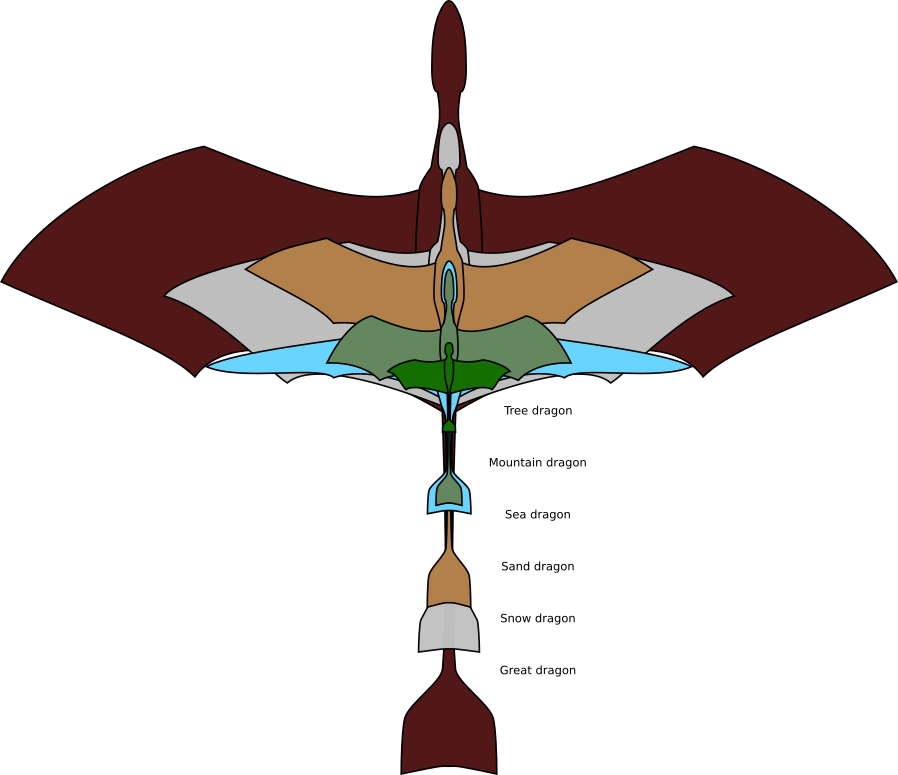

Dragons
=======

Six species of dragons make up the peoples of this world, varying in size and specifics, but sharing many traits.

Basic Information
-----------------

### Anatomy & Morphology

All dragons share a set of basic physiological traits. They are four-limbed, the forelimbs are membranous wings suspended between the body and the fourth digit of the hand with the fifth digit usually pointing back and expanding the membrane width; the hind limbs are much lighter in build and not used in flight.

The body is slender and elongated, usually around a fourth to a third of the wingspan in length from shoulder to base of tail, but has a deep chest and powerfully muscled shoulder girdle.

The tail is stiff and ranges from 1 to 2 times the body length depending on species, but in all species carries a flared horizontal fin used in steering and for aerial stability, at its tip. The base of the tail is flexible, allowing for its use in balance and maneuvering, as well as letting the dragon sit upright.

A muscular and flexible neck, usually less than the body length, supports a large, wedge-shaped head with a highly pneumatic skull, strong, sharp-fanged jaws, large nasal cavities and typically an array of crests and horns.

Dragons range in size from a little over a hundred pounds to giants weighing multiple tons. Due to their light build, however, they are even larger than their mass would indicate, with the aforementioned smallest dragons typically having a wingspan around 10 feet, and the largest spanning over a hundred.

#### Skeleton

Generally speaking dragon skeletons are highly pneumatized - most larger bones are hollow to save weight. The shoulder joints are firmly bonded to the rib cage, giving a strong attachment for the wings. The sternum has a pronounced keel, providing attachment for massive flight muscles. The pelvis is robust, with ample muscle fastenings for the tail muscles. While the base of the tail remains mobile, most of its length is stiffened by ossified tendons, which also anchor the spines that support the tail fin.

The arm bones are large and robust, with the upper arm tending to be shorter and stouter than the lower arm. The hand is elongated and narrow, with five digits. Digits four and five are hugely lengthened and stiffened to support the wing membrane, while the first three are much shorter, more flexible, and typically used in walking, grasping or manipulation.

The hind limbs are typically slender, and the four-toed feet simple. Climbing forms often have grasping, clawed feet, but the usual dragon foot is adapted only for walking, and economy of mass.

#### Musculature

As one might expect from a flying creature, wing musculature dominates the muscle weight of dragons. Powerful pectoral and shoulder muscles drive the down stroke of the wings, while pitch authority is provided by significant muscles at the base of the tail, using the length of it and the fin at its end as a lever against the air stream. Surprisingly, neck and jaw muscles are often powerful as well, in particular in forms that predate large land animals. Hind limb muscles are generally much more limited, as they are not significantly involved in flight, only being used for terrestrial locomotion, or in some forms, to assist in climbing.

#### The breath crop

An organ specific to dragons is the breath crop. Similar in structure to the crops found in birds or skithas for example, the breath crop is not used in digestion. Instead it serves as a reservoir and expulsion bellow for the dragon's breath weapon. Glands surrounding the crop create varying reagents, often varying degrees of toxic, caustic or flammable, which by mixture with mucus become raw material for the dragon's breath weapon. Some species, such as the snow dragons, create the entirety of their breath weapon fuels internally, while other species, such as tree dragons, ingest some of the raw materials from external sources.

### Biological Traits

Most dragon species are biomechanically focused on flight, although they retain adequate to excellent terrestrial and/or swimming capabilities. Some species also are able climbers, though the surfaces they are adapted to climb vary with their native biomes.

When on the ground, dragon limbs typically are close to vertical under the body, although the forelimbs are often bent to some degree, to account for their length. In the largest species, who are typically evolved towards a lifestyle as terrestrial stalkers and long-distance fliers, the hind limbs are relatively long, allowing a more erect walking posture, while the smaller forms will more often have shorter hind limbs and tend to curl their forelimbs under themselves more. In both cases, however, the wing supporting fingers are held up alongside the body, keeping the wing off the ground.

Water adapted dragons are usually able to land on and take off from the water's surface, and some can dive into water from the air at high speed. In the water, they typically swim with powerful wing strokes, using their wing fingers to control the spread and form of the wing membrane. Landing typically involves slowing down in the air to almost a hover before gently dropping in, though faster landings are possible as well. At the surface, dragons swim with a horizontal body posture, with the head held close to the water and keeping the nostrils above. Wings provide the propulsion, while bending the neck, body and tail provide steering.

Some smaller dragon species have origins in great forests or mountainous cliffs, and as a result are able climbers. The forelimbs, again, will be the major work limbs here, with the free fingers typically being strong and equipped with sizable claws. Burrowing dragons also exist, sharing these latter features, although they typically have smaller wings to fit inside their burrows.

#### Breath weapons

Most dragons are able to project some form of liquid, gas, or similar from their mouths. These range from high pressure bursts of water, over chemical mixtures with varying results, to salvos of stones emitted at high speed.

Generally, the emitted material is stored in a pair of pouches in the upper chest, and depending on the type can be sprayed, ejected as slugs, or even slowly poured, depending on the dragon and their wishes. Some dragons generate their breath on their own, while others store material away to be emitted later. The former typically have much lower volume, but special capabilities, while the latter have more mundane breaths, but make up on volume and less time dependent recharge.

### Genetics and Reproduction

The ancestral species of all the dragons in the modern world is a creature most similar to a modern [mountain dragon](mountain-dragons-article), though likely somewhat smaller, called *Draco aurorae*. While not advanced tool users, these early draconins were already accomplished burrowers and effective ecosystem engineers. The cooling episode circa 1.5 Mya caused a population (*D. frigus*) to grow larger and adapt to colder temperatures, giving up burrowing in favor of open-land hunting and coastal fishing, while more equatorial populations retained their lifestyles as montane hunters and scavengers.

As global temperatures again rose \~1 Mya, *D. aurorae* appears to have diverged into highland and lowland species, with the highland dragons (*D. nubibus*, a direct ancestor of modern [mountain dragons](mountain-dragons-article)) having grown a little larger and specialized further as burrowers and mountain hunters. Lowland dragons (*D. campestribus*) were smaller, and leaned toward scavenging and foraging, inhabiting forests and plains.

Around 600 kya, most of the modern species had appeared, with *D. frigus* having diverged into the larger, polar-adapted [snow dragons](snow-dragons-article) and the smaller, sleek and ocean-going [sea dragons](sea-dragons-article). Meanwhile, *D. campestribus* had separated into tiny arboreal [tree dragons](tree-dragons-article) and a much larger plains species, *D. maior*. The latter would diverge into desert living [sand dragons](sand-dragons-article) and gigantic [great dragons](great-dragons-article) within the following two hundred thousand years.

All six species reproduce by laying eggs, and show extensive nest and infant care. Compared to other flying species of the world, eggs tend to be large and few, a clutch typically consisting of between one and three eggs somewhere around 6-10% of the adult's body weight. Larger dragons lay fewer eggs, which are also larger in proportion to their own size.

### Growth Rate & Stages

Hatchling dragons are quite small and vulnerable, and need extensive care. Generally, this involves the parents and their family constantly caring for them for the first year of life, after which they will be capable of safe locomotion, basic flight, and basic problem solving and navigation. Hatchlings grow rapidly during this phase of life, from their hatching weight to somewhere around 25-30% adult weight. They will still require extensive parental guidance for their next several years of life as fledglings, as their skills, confidence and size all grow.

Around eight to nine years old, fledgling dragons are typically around half their adult mass, and will usually have developed limited independence, and while still strongly tied to their parents will be seen playing with their peers without significant supervision. Around this age they begin a subadult growth phase which will see them grow to their full size over the next four to six years, as well as developing fully adult cognitive and emotional faculties. This period in a dragon's life is often tumultuous and difficult, as they develop their identities and minds more fully, as well as having a strong adventurous tendency. This is also when their breath weapons develop into usefulness, which is occasionally a hazard. Dragons are typically considered adult, depending on culture, between their 15th and 20th year of life.

Additional Information
----------------------

### Facial characteristics

Dragons typically have light but impressive crests, horns, bosses or ridges, which are often a matter of great pride for the dragon. These vary greatly, and can identify family relationships within a species.

Genetic Descendants:
-   [Great dragons](great-dragons-article)
-   [Mountain dragons](mountain-dragons-article)
-   [Sand dragons](sand-dragons-article)
-   [Sea dragons](sea-dragons-article)
-   [Snow dragons](snow-dragons-article)
-   [Tree dragons](tree-dragons-article)

Scientific Name:   Draco (genus)

Body Tint, Colouring and Marking:   Dragon skin is generally smooth, covered in small scales that improve air flow over their bodies. Wing membranes do not have scales, but are covered in a thin coat of fur. Scales have a wide range of colors, and occasionally even show iridescence. Dragons often have patterned coloration, though brighter and more visible colors usually also have simpler patterning.
