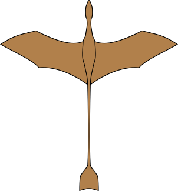

# Sand dragons

The dry, hot regions of the world are home to sand dragons - a slenderly built and well adapted species of dragon.

## Basic Information

### Anatomy & Morphology

Generally **Slender, wiry and tough**, sand dragons can seem almost lanky in comparison to the other dragon species. Evolved to survive in arid and harsh lands, they have a number of adaptations to help them survive. Uniquely, the fur on their wings can shift to both capture or release heat better, supporting them through both hot days and chilly nights.

### Air blast (stunt)

An interesting side of the breath weapon of these dragons is that it does not employ its fuel directly. Instead, the mixture combusts hotly as it leaves the mouth, creating a ferocious blast of heated air. This can be used to raise dust clouds, blow open doors, knock over tents, or destabilize the flight of an airborne opponent or prey item. Sand dragons have developed numerous techniques to create specific effects with these scalding air blasts, and masters of it can create images out of dust clouds.

### Dietary Needs and Habits

Food and water being scarce in their home regions, sand dragons have developed the ability to draw nutrients from many things. While they are principally hunters, they have **Hardy digestion and strong jaws**, meaning they can eat coarser plant material than most dragons, and have immunity or resistance to a number of plant toxins. This permits them to subsist off cactus and succulents to supplement more nutritious food sources.

## Civilization and Culture

### Common Dress Code

Fiber-based thread and cloth was a creation of sand dragons, as the means to cure skins effectively was less available to them. They are also the originators of a number of dyes. Even today, this plays a big role in how they appear, as they are likely to adorn themselves in light but colorful capes and other cloth garments.

### Culture and Cultural Heritage

While outsiders are prone to prejudice against sand dragons, they take a great deal of pride in their ingrained resilience and tenacity. Contrary to rumors, they typically do not scavenge carrion, cherish their offspring greatly, and have a strong inclination toward cleanliness. Living in such a hostile environment has made compassion a major virtue among them, as they know that the next one to need help may be themselves. Prejudice from outsiders has fostered some distrust of them, however foreigners found in distress will almost always be rescued and treated well.

Large permanent settlements have logistical difficulties in the desert regions of the world, which has meant that nomadic lifestyles have been more successful. However, seasonal cities have sprung up for many generations, as trade, news and other areas of interest have gathered tribes and groups of sand dragons into the same time and space. In recent years, some of these seasonal cities have become feasible to inhabit year round as food and water sources have been secured with new technology.

Genetic Ancestor(s): [Dragons](/creatures/dragons.md)

Scientific Name: Draco harenae

Average Weight: 500-600 lbs.

Average Length: Wingspan typically between 40 and 50 feet.

### Sand dragon size analogies

A table comparing sand dragon size to other dragons through analogies to human size

    -------------------------------------------------
    Compared to a sand dragon   Compared to a human
    --------------------------- ---------------------
    Tree dragon                 Hare
    Mountain dragon             Rottweiler
    Sea dragon                  Roe deer
    Snow dragon                 Brown bear
    Great dragon                American Bison
    -------------------------------------------------
